# Cloud-Native Payment API on Amazon EKS


A production-oriented DevOps project demonstrating end-to-end deployment of a containerized application on Amazon EKS — covering Infrastructure as Code, Kubernetes operations, security, CI/CD automation, and observability.

> This project is built incrementally through sprints. Each sprint leaves the system in a fully functional, deployable state. The goal is not just a working application — it is a platform that reflects real production thinking.

---

## Table of Contents

- [Project Goals](#project-goals)
- [Architecture](#architecture)
- [Project Structure](#project-structure)
- [Sprint Documentation](#sprint-documentation)
  - [Sprint 0 — Terraform Backend Bootstrap](#sprint-0--terraform-backend-bootstrap)
  - [Sprint 1 — EKS Foundation and First Workload](#sprint-1--eks-foundation-and-first-workload)
  - [Sprint 2 — CI/CD Pipeline with GitHub Actions](#sprint-2--cicd-pipeline-with-github-actions)
- [Deployment](#deployment)
- [Future Sprints](#future-sprints)

---

## Project Goals

**Functional:**

- Deploy a Flask REST API on Kubernetes running on Amazon EKS
- Store container images in Amazon ECR with lifecycle management and scanning
- Expose health-check endpoints for Kubernetes probe integration
- Integrate with DynamoDB for persistent payment storage (Sprint 3)

**Non-Functional:**

- Infrastructure provisioned entirely through Terraform — no manual console operations
- Kubernetes-native deployment model with proper resource isolation
- Secure networking: workloads in private subnets, no public node exposure
- Pod-level IAM access through IRSA — no static AWS credentials (Sprint 3)
- Automated CI/CD pipeline with security gate — no manual deployments (Sprint 2)
- Horizontal scalability through HPA (Sprint 5)
- Full observability through Prometheus and Grafana (Sprint 6)

---

## Architecture

```
                        ┌─────────────────────────────────────────────┐
                        │              AWS eu-central-1                │
                        │                                              │
                        │   ┌──────────────────────────────────────┐  │
                        │   │           VPC 10.0.0.0/16            │  │
                        │   │                                      │  │
                        │   │  ┌─────────────┐ ┌───────────────┐  │  │
                        │   │  │  Public A   │ │   Public B    │  │  │
  kubectl / CI/CD ──────┼───┼──│ 10.0.1.0/24 │ │ 10.0.2.0/24  │  │  │
                        │   │  │  (future    │ │ (future ALB)  │  │  │
                        │   │  │   ALB)      │ │               │  │  │
                        │   │  └──────┬──────┘ └───────────────┘  │  │
                        │   │         │ NAT Gateway                │  │
                        │   │  ┌──────▼──────┐ ┌───────────────┐  │  │
                        │   │  │  Private A  │ │   Private B   │  │  │
                        │   │  │10.0.11.0/24 │ │10.0.12.0/24   │  │  │
                        │   │  │  EKS Node   │ │   EKS Node    │  │  │
                        │   │  │  Pod: API   │ │   Pod: API    │  │  │
                        │   │  └─────────────┘ └───────────────┘  │  │
                        │   │                                      │  │
                        │   │  EKS Control Plane (AWS Managed)     │  │
                        │   └──────────────────────────────────────┘  │
                        │                                              │
                        │   ┌──────────┐   ┌──────────────────────┐   │
                        │   │   ECR    │   │  DynamoDB (Sprint 3) │   │
                        │   │ (images) │   └──────────────────────┘   │
                        │   └──────────┘                               │
                        └─────────────────────────────────────────────┘
```

**Traffic flow (current — Sprint 2):**

| Source | Destination | Method |
|---|---|---|
| Developer | EKS API Server | `kubectl` via AWS IAM token |
| GitHub Actions | AWS STS | OIDC token → temporary credentials |
| GitHub Actions | ECR | Docker push via pipeline |
| GitHub Actions | EKS | `kubectl apply` via pipeline |
| EKS Nodes | ECR | Image pull via NAT Gateway |
| Developer | Application | `kubectl port-forward` (temporary) |

Public ingress via ALB will be introduced in Sprint 4.

---

## Project Structure

```
eks-platform/
├── terraform/
│   ├── bootstrap/                    # Sprint 0 — S3 + DynamoDB state backend
│   └── infrastructure/               # Sprint 1 — VPC + EKS + ECR + IAM
│       ├── backend.tf
│       ├── provider.tf
│       ├── main.tf
│       ├── variables.tf
│       ├── outputs.tf
│       ├── terraform.tfvars
│       └── modules/
│           ├── vpc/
│           ├── eks/
│           ├── ecr/
│           └── github-actions-iam/   # Sprint 2 — OIDC auth for pipeline
├── app/
│   ├── app.py
│   ├── requirements.txt
│   └── Dockerfile
├── k8s/
│   ├── namespace.yaml
│   ├── serviceaccount.yaml
│   ├── deployment.yaml
│   └── service.yaml
├── docs/
│   └── screenshots/                  # Sprint validation screenshots
└── .github/
    └── workflows/
        └── ci-cd.yml                 # Sprint 2 — GitHub Actions pipeline
```

---

## Sprint Documentation

---

### Sprint 0 — Terraform Backend Bootstrap

#### Objective

Before provisioning any infrastructure, a centralized and secure Terraform state backend was established. Using local state files in team or multi-sprint environments leads to state drift, accidental overwrites, and loss of infrastructure history. Solving this first — before any real resources exist — is the correct order of operations.

#### Components Implemented

**S3 Remote State**

An S3 bucket with versioning enabled stores all Terraform state files for the project. Versioning provides a recovery path in case of accidental state corruption or destructive operations.

**DynamoDB State Locking**

A DynamoDB table provides state locking — ensuring only one Terraform operation can execute at a time. Without locking, concurrent `terraform apply` runs can corrupt the state file in ways that are difficult to recover from.

#### Design Decisions

**Why a dedicated bootstrap module?**

The bootstrap resources (S3 bucket, DynamoDB table) cannot be managed by the same Terraform backend they are creating. They are provisioned once using local state, and from that point forward all other infrastructure uses the remote backend. This is the standard pattern for Terraform on AWS — the chicken-and-egg problem solved by explicit separation.

**Why S3 + DynamoDB instead of Terraform Cloud?**

This project runs entirely on AWS. Keeping state in S3 avoids introducing an external dependency, keeps all access control within IAM, and reflects the setup used in most AWS-based production environments.

#### Sprint Outcome

Terraform remote state operational. All subsequent infrastructure modules use the S3 backend with DynamoDB locking. Zero local state files exist outside the `bootstrap/` directory.

---

### Sprint 1 — EKS Foundation and First Workload

#### Objective

Provision a production-style Kubernetes platform on AWS and deploy the first application workload. The focus was on getting the infrastructure right — not just running pods, but understanding the decisions behind every layer.

This sprint establishes the foundation everything else builds on: networking, compute, container registry, and the first running workload. Every decision made here has consequences in later sprints.

#### Infrastructure Decisions

**VPC Design**

Worker nodes are deployed in private subnets with no public IP addresses. Public subnets are reserved for future load balancers (Sprint 4). This separation is not cosmetic — it means that even if a node is misconfigured, it cannot be reached directly from the internet. This is not a Security Group rule that can be accidentally changed — it is a routing decision with no path from the internet to a node in a private subnet.

A single NAT Gateway was deployed in `eu-central-1a`. The trade-off here is explicit: a single NAT Gateway is a potential availability bottleneck, but for a dev environment it reduces cost significantly. In a production multi-AZ setup, each private subnet would have its own NAT Gateway.

Public and private subnets are tagged with `kubernetes.io/role/elb` and `kubernetes.io/role/internal-elb` respectively. These tags are not optional — without them, the AWS Load Balancer Controller introduced in Sprint 4 cannot discover which subnets to use when creating ALB resources. Configuring them now avoids having to modify subnets later.

**EKS Cluster**

The Kubernetes control plane is fully managed by AWS. It is not accessible via SSH — all interactions go through the EKS API server using IAM-authenticated tokens generated by the AWS CLI. This is fundamentally different from self-managed Kubernetes clusters and was one of the first concepts to internalize during this sprint.

The OIDC provider was configured at cluster creation time, even though it is not used until Sprint 3. Configuring it now costs nothing and avoids modifying cluster configuration later. Without it, Sprint 3 (IRSA) would require an infrastructure change to an already-running cluster.

`endpoint_private_access = true` ensures that traffic between nodes and the API Server stays inside the VPC and does not traverse the public internet.

`enabled_cluster_log_types = ["api", "audit"]` — API logs capture all Kubernetes API calls for debugging. Audit logs record who did what on the cluster — useful when debugging IRSA issues in Sprint 3.

**Managed Node Group vs. EKS Auto Mode**

Managed Node Group was chosen over EKS Auto Mode deliberately. Auto Mode abstracts away node lifecycle entirely, which is convenient but reduces visibility into how worker infrastructure behaves. For a project focused on demonstrating Kubernetes knowledge, understanding node provisioning, instance types, and scaling configuration is more valuable than the operational convenience Auto Mode provides. Auto Mode is a reasonable production choice — Managed Node Group is a better learning choice.

Node instances use `t3.medium`. This is the minimum size that comfortably runs the application alongside system pods (CoreDNS, kube-proxy, VPC CNI) and leaves capacity for the Prometheus stack added in Sprint 6. `t3.small` was considered and ruled out due to memory pressure under monitoring workloads.

**IAM Roles**

Two IAM roles are required before a single node can join the cluster.

The cluster role is assumed by the EKS control plane itself — allows AWS to manage load balancers, security groups, and networking resources on behalf of the cluster.

The node role is assumed by every EC2 worker node at boot. Three policies are attached, each serving a distinct purpose:

| Policy | Purpose |
|---|---|
| `AmazonEKSWorkerNodePolicy` | Allows the node to register with the EKS control plane. Without this, the node cannot join the cluster. |
| `AmazonEKS_CNI_Policy` | Allows the VPC CNI plugin to manage network interfaces and IP addresses for pods. Without this, pods cannot get IP addresses. |
| `AmazonEC2ContainerRegistryReadOnly` | Allows the node to pull container images from ECR. The node pulls images before pods start — IRSA cannot be used at that point. |

All three policies are required. Removing any one breaks a different part of the cluster.

**ECR Repository**

ECR was configured with `scan_on_push = true` and a lifecycle policy that retains only the last 10 images. The lifecycle policy is often omitted in portfolio projects — it matters in practice because unmanaged ECR repositories accumulate images and eventually generate unexpected storage costs.

#### Security Decisions

Every security decision in this sprint was intentional rather than incidental:

- Worker nodes run in private subnets — no public IP exposure
- Container runs as non-root (`USER 1000` in Dockerfile, `runAsUser: 1000` in pod spec)
- `endpoint_private_access = true` on the EKS cluster — kubectl traffic stays within the VPC when possible
- No static AWS credentials anywhere — kubeconfig uses IAM token authentication
- ECR `scan_on_push` enabled — basic CVE detection before images run on the cluster

IRSA (pod-level IAM) is the remaining critical security piece, introduced in Sprint 3 when the application needs actual AWS service access.

#### Application

The Flask API exposes three endpoints: `GET /health`, `POST /payments`, and `GET /payments/{id}`. In Sprint 1 the application uses in-memory storage — payments are stored in a Python dictionary and lost on pod restart. This is intentional: DynamoDB integration comes in Sprint 3 once IRSA is configured. Building the data layer before the IAM layer would mean deploying the application with static AWS credentials — the wrong approach.

**Dockerfile layer ordering** — `requirements.txt` is copied and installed before `app.py`. Docker caches each layer independently. `app.py` changes on every commit. `requirements.txt` changes rarely. With this order, `pip install` uses the cache on every build where requirements have not changed — significantly faster builds.

#### Kubernetes Workload

**Namespace**

All resources are deployed in a dedicated `payment-api` namespace rather than `default`. This is a foundational practice — it enables RBAC scoping, resource quota enforcement, and network policy targeting. Using `default` in a real cluster is considered an anti-pattern.

**ServiceAccount**

A dedicated `payment-api` ServiceAccount is created and assigned to all pods. In Sprint 1 it has no annotations and no AWS permissions. It exists because pods should never run under the `default` ServiceAccount, and because in Sprint 3 a single annotation will be added to give it DynamoDB access through IRSA — no changes to the Deployment will be needed at that point.

**Deployment**

The Deployment runs two replicas with a `RollingUpdate` strategy (`maxSurge: 1`, `maxUnavailable: 0`). Setting `maxUnavailable: 0` means Kubernetes will never reduce capacity below the desired replica count during an update — new pods must become ready before old ones are terminated. This guarantees zero-downtime deployments even at this early stage.

Resource `requests` and `limits` are set on every container. Without requests, the Kubernetes scheduler cannot make informed placement decisions. Without limits, a misbehaving container can starve other pods on the same node. CPU limit causes throttling; memory limit causes OOMKill.

**Health Checks**

Both `livenessProbe` and `readinessProbe` target the `/health` endpoint:

- The readiness probe controls traffic routing. If it fails, Kubernetes removes the pod from the Service endpoints — the pod keeps running but receives no traffic. This is essential for safe rolling updates.
- The liveness probe controls pod lifecycle. If it fails three consecutive times, Kubernetes restarts the container. This handles scenarios where the process is running but has entered a broken state it cannot recover from.

The distinction between these two probes is frequently tested in Kubernetes interviews and misunderstood in practice. Configuring both correctly from the start reflects production thinking.

**Service**

A `ClusterIP` Service was used intentionally. Exposing the application directly via `NodePort` or `LoadBalancer` at this stage would work, but would bypass the proper ingress layer introduced in Sprint 4. `ClusterIP` keeps the application internal until a production-grade ALB Ingress is in place.

#### Challenges Encountered

**kubectl Authentication Failure**

After provisioning the cluster, all `kubectl` commands failed with:

```
exec plugin: invalid apiVersion "client.authentication.k8s.io/v1alpha1"
```

The root cause was a mismatch between the local `kubectl` binary (an older version) and the authentication mechanism expected by EKS 1.31. EKS moved from `v1alpha1` to `v1beta1` for the exec credential API in newer cluster versions.

The fix was upgrading `kubectl` to 1.31 and regenerating kubeconfig with `aws eks update-kubeconfig`. The lesson: `kubectl` version and cluster version do not need to be identical, but they must be close enough that the authentication API versions overlap. A gap of more than one minor version frequently causes this class of error.

**ECR Authentication Failure**

Initial `docker push` to ECR failed silently. The root cause was that Docker Desktop was not running — the Docker daemon was unavailable, so the ECR credential helper had nothing to authenticate to.

This highlights a non-obvious dependency: ECR authentication requires both valid AWS credentials and a running Docker daemon. The AWS CLI side succeeds and produces a token. The Docker side fails because there is no daemon to receive it — and the error messages from both tools point in different directions.

**Understanding EKS Control Plane Access**

The initial expectation was that cluster management would require SSH access to control plane nodes — the same mental model as self-managed Kubernetes. Amazon EKS abstracts the control plane entirely: there are no control plane nodes to SSH into.

`kubectl` is a client that communicates with the EKS API server endpoint over HTTPS. Authentication happens through an IAM token generated by the AWS CLI and embedded in the kubeconfig. This is a fundamental shift in operational model compared to self-managed clusters — control plane logs are accessed through CloudWatch rather than directly.

**Initial kubectl apply failed due to manifest ordering**

```
Error from server (NotFound): namespaces "payment-api" not found
```

`kubectl apply -f k8s/` applies manifests in alphabetical order. `deployment.yaml` is processed before `namespace.yaml`. The fix was applying the namespace first. The long-term fix is Helm (Sprint 5), which handles resource ordering automatically.

#### Validation

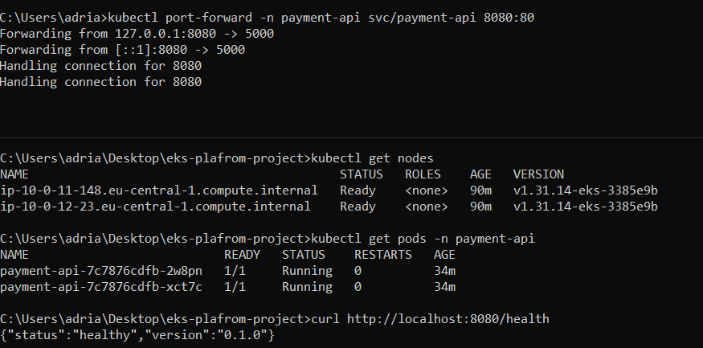  
*Two worker nodes in Ready state, two application pods Running, health check returning 200 via port-forward.*


#### Key Lessons Learned

**Private subnets provide a harder security boundary than Security Groups.** A Security Group rule can be changed accidentally. A missing route cannot be traversed regardless of any other configuration — there is simply no path from the internet to a node in a private subnet.

**Node IAM roles and pod IAM roles serve different purposes.** Nodes need broad permissions to function: join the cluster, manage pod networking, pull images. Pods need narrow permissions scoped to exactly what the application does. IRSA (Sprint 3) solves this by giving each pod its own scoped role.

**Dockerfile layer ordering is a performance decision.** Copying dependencies before application code exploits Docker's layer cache. Stable layers first, volatile layers last.

**Configure prereqs before they are needed.** The OIDC provider is unused in Sprint 1 but configured anyway. The ServiceAccount has no annotations in Sprint 1 but is created with the correct name. These decisions cost nothing and avoid modifying running infrastructure later.

---

### Sprint 2 — CI/CD Pipeline with GitHub Actions

#### Objective

The objective of Sprint 2 was to eliminate all manual deployment steps introduced in Sprint 1 and replace them with a fully automated, security-first CI/CD pipeline.

Before this sprint, every code change required a manual sequence: local Docker build, manual ECR authentication, manual image push, and manual `kubectl apply`. This approach does not scale, is error-prone, and — critically — requires long-lived AWS credentials stored somewhere accessible to the operator. Sprint 2 solves all of these problems at once.

The pipeline is built around three principles: no static AWS credentials anywhere, a security gate that blocks vulnerable images before they reach the cluster, and a clean separation between the build phase and the deploy phase.

#### Architecture

```
Developer
    │
    │  git push → main
    ▼
GitHub Actions Runner
    │
    ├── 1. OIDC token request → AWS STS
    │       └── STS validates token against GitHub OIDC provider
    │       └── Returns temporary credentials (15 min TTL)
    │
    ├── 2. CI Job
    │       ├── docker build
    │       ├── Trivy scan → CRITICAL CVE? → pipeline fails, nothing pushed
    │       └── docker push → ECR (only if scan passes)
    │
    └── 3. CD Job (only on push to main, not on PR)
            ├── aws eks update-kubeconfig
            ├── sed IMAGE_PLACEHOLDER → actual ECR URL:SHA tag
            ├── kubectl apply -f k8s/
            └── kubectl rollout status → verify deploy succeeded
```

#### Components Implemented

**IAM Role for GitHub Actions**

A dedicated IAM Role was created through Terraform in a new module `modules/github-actions-iam`.

**ECR policy** — scoped to the specific ECR repository ARN, not `*`. Allows only the operations needed for image push: layer upload, image put, authorization token.

**EKS policy** — allows only `eks:DescribeCluster` on the specific cluster ARN. This is the minimum required for `aws eks update-kubeconfig` to work. GitHub Actions cannot list clusters, cannot modify the cluster, cannot access other clusters in the account.

**OIDC Trust Policy**

The IAM Role trust policy uses two conditions:

```json
"StringEquals": {
  "token.actions.githubusercontent.com:aud": "sts.amazonaws.com"
},
"StringLike": {
  "token.actions.githubusercontent.com:sub": "repo:adrian-cloud-devops/cloud-native-payment-api-eks:*"
}
```

The `aud` condition ensures the token was intended for AWS STS, not another service. The `sub` condition scopes the trust to a specific GitHub repository — even if another repository in the same GitHub organization tries to assume this role, it will be denied.

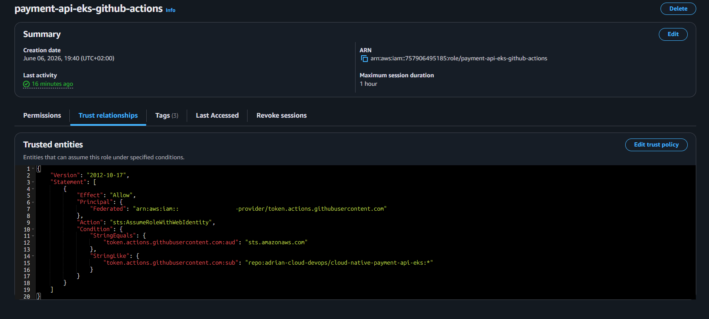
*IAM Role trust policy scoped to the specific GitHub repository — only this repo can assume the role*

**GitHub OIDC Provider in AWS**

A separate `aws_iam_openid_connect_provider` resource was created for GitHub's OIDC endpoint. This is distinct from the EKS OIDC provider created in Sprint 1 — that one is for pod-level IAM (IRSA), this one is for GitHub Actions authentication. Same protocol, different token issuers, different use cases:

| Provider | Authority | Purpose |
|---|---|---|
| EKS OIDC | AWS | Issues tokens for pods — enables IRSA |
| GitHub OIDC | GitHub | Issues tokens for pipeline runs — enables keyless auth |

The thumbprint `6938fd4d98bab03faadb97b34396831e3780aea1` is the SHA1 fingerprint of GitHub's OIDC certificate. AWS uses this to verify that tokens claiming to come from GitHub actually do — the same way a browser verifies an HTTPS certificate against a known CA.

**EKS Access Entry**

GitHub Actions needs not just AWS credentials but also Kubernetes RBAC permissions to deploy. EKS Access Entries were used to grant the GitHub Actions role the `AmazonEKSEditPolicy` scoped to the `payment-api` namespace only. GitHub Actions cannot touch `kube-system`, cannot read secrets from other namespaces, and cannot modify cluster-level resources.

#### Pipeline Design Decisions

**Why two separate jobs (ci and cd)?**

The `cd` job runs only when `github.event_name == 'push'` and `github.ref == 'refs/heads/main'`. Pull requests trigger only the `ci` job. This means every PR gets a build and security scan, but nothing gets deployed until code is merged to main.

**Why commit SHA as image tag?**

```yaml
echo "tag=${GITHUB_SHA::8}" >> $GITHUB_OUTPUT
```

The first 8 characters of the commit SHA are used as the image tag — traceability, immutability, auditability. The `:latest` tag is also pushed for convenience but the deployment always uses the SHA tag. Using `:latest` in a Deployment spec makes rollbacks ambiguous.

**Why Trivy before push?**

```
build → scan → (fail here if CRITICAL) → push
```

An image with a known critical vulnerability never reaches ECR and never reaches the cluster. `ignore-unfixed: true` means Trivy only fails on CVEs that have a known fix available.

**Why `kubectl rollout status` at the end?**

`kubectl apply` returns success as soon as the API server accepts the manifest — not when pods are actually running. `kubectl rollout status` blocks until pods are Ready or the 5-minute timeout is reached. Green pipeline means the application is actually running, not just that the manifest was accepted.

#### Security Model

| What | Old approach | This sprint |
|---|---|---|
| AWS auth in pipeline | IAM User + access key in GitHub Secrets | OIDC → temporary STS credentials (15 min TTL) |
| ECR permissions | Full ECR access or AdministratorAccess | Scoped to single repository, push operations only |
| EKS permissions | Full cluster access or cluster-admin | Edit policy scoped to `payment-api` namespace only |
| Vulnerable images | No gate | Trivy blocks CRITICAL CVEs before push |
| Credentials rotation | Manual | Not needed — credentials are ephemeral |

#### Workflow Structure

```yaml
on:
  push:
    branches: [main]      # triggers ci + cd
  pull_request:
    branches: [main]      # triggers ci only

jobs:
  ci:                     # runs on push AND pull_request
    - Configure AWS (OIDC)
    - Login to ECR
    - Generate image tag (SHA-based)
    - Docker build
    - Trivy scan (exit-code: 1 on CRITICAL)
    - Docker push (only if scan passes)

  cd:
    needs: ci             # waits for ci to complete successfully
    if: push to main      # skipped on pull_request
    - Configure AWS (OIDC)
    - Configure kubectl
    - Deploy (sed IMAGE_PLACEHOLDER + kubectl apply)
    - Verify rollout
```

#### Challenges Encountered

**OIDC authentication failing — wrong repository name**

```
Error: Could not assume role with OIDC:
Not authorized to perform sts:AssumeRoleWithWebIdentity
```

The root cause was a mismatch between the GitHub repository name in `terraform.tfvars` (`eks-platform`) and the actual repository name on GitHub (`cloud-native-payment-api-eks`). The IAM trust policy `StringLike` condition is case-sensitive — any mismatch causes an immediate denial.

The fix was correcting `github_repository` in `terraform.tfvars` and running `terraform apply` to update only the trust policy. Terraform did not rebuild any infrastructure — it only modified the IAM role's trust relationship document.

**EKS authentication mode incompatible with Access Entries**

```
InvalidRequestException: The cluster's authentication mode must be set
to one of [API, API_AND_CONFIG_MAP] to perform this operation.
```

The EKS cluster was created with the default `CONFIG_MAP` only authentication mode, which does not support the Access Entries API. The cluster authentication mode was updated without rebuilding:

```bash
aws eks update-cluster-config \
  --name payment-api-eks \
  --region eu-central-1 \
  --access-config authenticationMode=API_AND_CONFIG_MAP
```

Going forward, the EKS Terraform module explicitly sets `authentication_mode = "API_AND_CONFIG_MAP"` to avoid this on future cluster builds.

**Hardcoded image URL masked a silent pipeline misconfiguration**

`deployment.yaml` initially contained a hardcoded ECR URL with `:latest` instead of `IMAGE_PLACEHOLDER`. The pipeline appeared to work — pods were running, health checks passed. However, the `sed` substitution step was silently doing nothing because `IMAGE_PLACEHOLDER` was not present in the file. Every deploy was using whatever image was already tagged `:latest` in ECR, not the SHA-tagged image built by the current run.

The pipeline's core feature — traceability via SHA tags — was not functioning. A deploy would show green even if the ECR push had failed.

The fix was replacing the hardcoded URL with `IMAGE_PLACEHOLDER` in `deployment.yaml`. The lesson: a passing pipeline is not proof the pipeline does what you think. Validating the actual outcome — checking the image tag on the running pod after deploy — is a necessary verification step.

**Two OIDC providers, one protocol — initial confusion**

During implementation it was initially unclear why the project has two separate OIDC providers. Both use the same OIDC protocol but serve entirely different purposes. The EKS OIDC provider authenticates pods (IRSA) — AWS is the authority. The GitHub OIDC provider authenticates pipeline runs — GitHub is the authority. Keeping them mentally separate is important when debugging authentication failures: an OIDC error in the pipeline is always a GitHub provider issue, never an EKS provider issue.

#### Validation

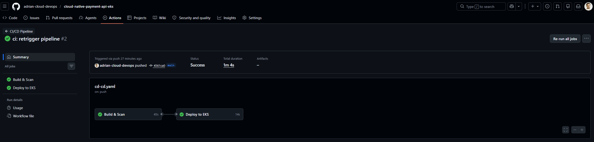
*Both CI and CD jobs completed successfully — total duration 1m 4s.*

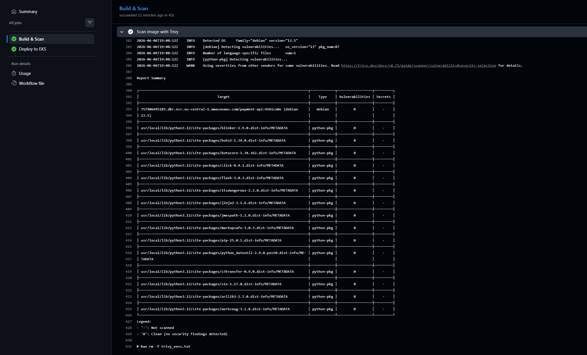
*Zero vulnerabilities detected. Pipeline proceeded to push only after this gate passed.*

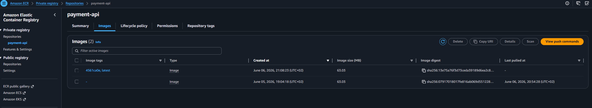
*Image tagged with commit SHA `4561ca0e` alongside `:latest` — full traceability from pod to commit.*

#### Key Lessons Learned

**OIDC is the correct authentication pattern for CI/CD on AWS.** OIDC tokens are ephemeral by design — issued per-run, scoped to the specific repository, expire automatically. There is no credential to rotate, no secret to leak, and no manual intervention required.

**A green pipeline is not proof the pipeline does what you think.** Silent failures are harder to catch than loud ones. The hardcoded image URL showed that a pipeline can appear healthy while a core feature is not functioning.

**Two OIDC providers, one protocol.** EKS OIDC authenticates pods, GitHub OIDC authenticates pipeline runs. Same protocol, different token issuers — keeping them mentally separate avoids confusion when debugging.

**Namespace isolation compounds across the stack.** GitHub Actions role scoped to `payment-api` namespace, ECR policy scoped to `payment-api` repository, application running in `payment-api` namespace — each layer independently enforces the same boundary.

#### Sprint Outcome

From this sprint forward, the deployment workflow is:

```
git push → pipeline runs → image built and scanned → deployed to EKS → rollout verified
```

No manual steps. No AWS credentials on any developer machine. No unscanned images reaching the cluster. Every deployment traceable to a specific commit SHA.

---

# Sprint 3 — DynamoDB Integration with IRSA

## Objective

The objective of Sprint 3 was to replace the in-memory storage introduced in Sprint 1 with a persistent, production-grade data layer — and to do so without introducing any static AWS credentials into the application or the cluster.

Before this sprint, payments were stored in a Python dictionary inside the pod. A pod restart meant losing all data. More importantly, any future AWS service integration would require storing AWS credentials somewhere — as environment variables, Kubernetes Secrets, or hardcoded values. Sprint 3 solves both problems at once: DynamoDB provides persistent storage, and IRSA provides the authentication mechanism to access it without any long-lived credentials.

---

## Architecture

```
POST /payments
    │
    ▼
Flask API (pod)
    │
    ├── JWT token mounted at:
    │   /var/run/secrets/eks.amazonaws.com/serviceaccount/token
    │
    ├── boto3 sends token to AWS STS:
    │   "AssumeRoleWithWebIdentity"
    │
    ├── STS verifies token against EKS OIDC Provider
    │
    ├── STS returns temporary credentials (1h TTL)
    │
    └── boto3 calls DynamoDB PutItem
            └── data persists across pod restarts
```

**IRSA trust chain:**

```
EKS OIDC Provider    ← registered in Sprint 1, used here
    ↓ issues JWT tokens for pods
ServiceAccount       ← annotated with IAM Role ARN
    ↓ pods using this SA get the token automatically
IAM Role             ← trust policy scoped to this SA + namespace
    ↓ only this pod in this namespace can assume this role
IAM Policy           ← GetItem + PutItem on this specific table only
    ↓ least privilege — nothing else accessible
DynamoDB Table       ← payment-api-payments
```

---

## Components Implemented

### DynamoDB Table — `modules/dynamodb/`

A dedicated Terraform module provisions the payments table:

```hcl
resource "aws_dynamodb_table" "payments" {
  name         = var.table_name
  billing_mode = "PAY_PER_REQUEST"
  hash_key     = "payment_id"

  attribute {
    name = "payment_id"
    type = "S"
  }
}
```

`PAY_PER_REQUEST` billing was chosen over provisioned capacity — for a dev/portfolio workload with unpredictable traffic, on-demand billing costs nothing when idle and scales automatically under load. No capacity planning required.

`payment_id` as the hash key means every payment is uniquely addressable by its ID — which maps directly to the `GET /payments/{id}` API endpoint.

### IRSA Module — `modules/irsa/`

A reusable Terraform module that creates an IAM Role with a trust policy scoped to a specific Kubernetes ServiceAccount:

```hcl
Condition = {
  StringEquals = {
    "${oidc_url}:sub" = "system:serviceaccount:payment-api:payment-api"
    "${oidc_url}:aud" = "sts.amazonaws.com"
  }
}
```

The trust policy uses `StringEquals` (not `StringLike`) — an exact match on both the ServiceAccount name and namespace. A pod in a different namespace with the same ServiceAccount name cannot assume this role. A pod in the same namespace with a different ServiceAccount cannot assume this role.

The IAM Policy attached to the role grants only two DynamoDB operations on the specific table ARN:

```json
{
  "Action": ["dynamodb:GetItem", "dynamodb:PutItem"],
  "Resource": "arn:aws:dynamodb:eu-central-1:ACCOUNT:table/payment-api-payments"
}
```

No `Scan`, no `DeleteItem`, no `UpdateItem`, no access to other tables. This is least privilege at the pod level — something not achievable with node IAM roles.

The module is designed to be reusable — any future service that needs AWS access gets its own IRSA module invocation with its own scoped role.

### EKS Access Entries — moved to Terraform

A recurring operational issue (detailed in Challenges) led to moving EKS Access Entries into Terraform:

```hcl
access_config {
  authentication_mode = "API_AND_CONFIG_MAP"
}

resource "aws_eks_access_entry" "github_actions" { ... }
resource "aws_eks_access_entry" "admin" { ... }
```

Every `terraform apply` now automatically configures cluster access for both the CI/CD pipeline and the local operator. No manual CLI commands required after provisioning.

### ServiceAccount — annotated for IRSA

The `payment-api` ServiceAccount created empty in Sprint 1 now has the IRSA annotation:

```yaml
annotations:
  eks.amazonaws.com/role-arn: arn:aws:iam::ACCOUNT:role/payment-api-eks-payment-api-role
```

This single annotation is the only Kubernetes-side change needed to enable IRSA. EKS automatically detects it at pod start and:
- mounts the JWT token at `/var/run/secrets/eks.amazonaws.com/serviceaccount/token`
- injects `AWS_ROLE_ARN` and `AWS_WEB_IDENTITY_TOKEN_FILE` environment variables

No changes to the Deployment spec were needed — the ServiceAccount was already referenced there since Sprint 1.

### Flask Application — DynamoDB integration

The in-memory dictionary was replaced with boto3 DynamoDB calls:

```python
dynamodb = boto3.resource("dynamodb", region_name=os.getenv("AWS_REGION"))
table = dynamodb.Table(os.getenv("DYNAMODB_TABLE", "payment-api-payments"))

# POST /payments
table.put_item(Item={"payment_id": payment_id, "status": "created"})

# GET /payments/{id}
response = table.get_item(Key={"payment_id": payment_id})
```

boto3 automatically discovers credentials through the AWS credential provider chain. When `AWS_WEB_IDENTITY_TOKEN_FILE` is present (injected by EKS via IRSA), boto3 uses it to obtain temporary STS credentials. No explicit credential configuration in the application code — the infrastructure handles authentication transparently.

---

## Why Node IAM Role Was Not Used

The simplest way to give the application DynamoDB access would have been adding a DynamoDB policy to the node IAM role. This was deliberately rejected:

```
Node IAM Role approach:
  Every pod on the node gets DynamoDB access
  → prometheus pods, coredns pods, system pods
  → any compromised pod on the node has database access

IRSA approach:
  Only the payment-api pod with the payment-api ServiceAccount
  in the payment-api namespace gets DynamoDB access
  → blast radius of a compromised pod is limited to one table
  → two operations only: GetItem and PutItem
```

IRSA enables least privilege at the pod level. Node IAM roles enable least privilege at the node level — a much coarser granularity that is insufficient for production security requirements.

---

## Validation

### IRSA active — environment variables injected by EKS

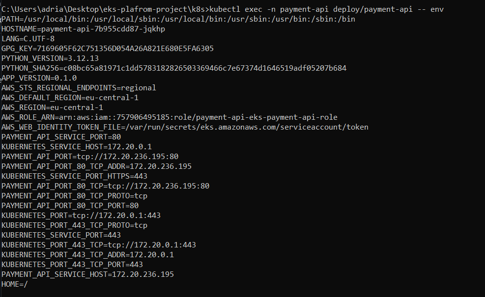  
*`AWS_ROLE_ARN` and `AWS_WEB_IDENTITY_TOKEN_FILE` injected automatically by EKS when the ServiceAccount has the IRSA annotation. No static credentials anywhere in the pod.*

### ServiceAccount with IRSA annotation

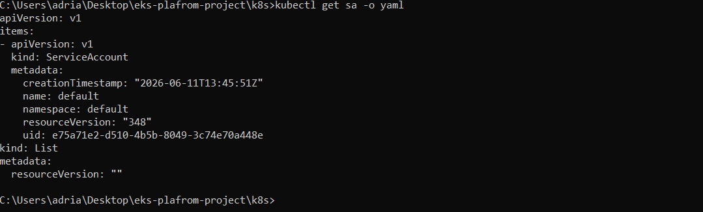  
*ServiceAccount annotated with the IAM Role ARN. This single annotation connects the Kubernetes identity layer to the AWS IAM layer.*

### Persistence test — data survives pod restart

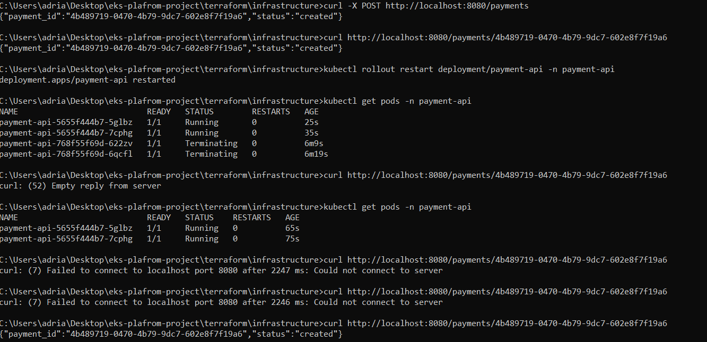  
*Payment created, pod restarted with `kubectl rollout restart`, payment retrieved successfully after restart. In-memory storage would have returned 404 — DynamoDB returns the original record.*

### DynamoDB Console — records visible

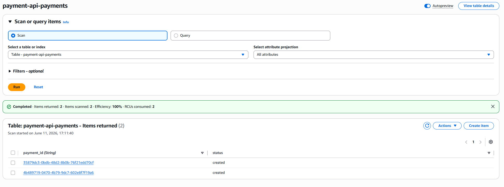  
*Two payment records in the DynamoDB table. Data written by the Flask API through IRSA credentials, visible in AWS Console independently of any pod state.*

---

## Challenges Encountered

### EKS Access Entries lost after terraform destroy

After every `terraform destroy` and `terraform apply` cycle, the EKS cluster was recreated without any Access Entries. Both the local operator and GitHub Actions lost cluster access — requiring manual CLI commands to restore it each time.

The root cause: EKS in `API_AND_CONFIG_MAP` authentication mode does not automatically grant the cluster creator any access. Every principal must be explicitly defined through Access Entries. This is a deliberate security design — but it means the infrastructure code must be complete.

The fix was adding Access Entry resources directly to the EKS Terraform module:

```hcl
resource "aws_eks_access_entry" "admin" {
  cluster_name  = aws_eks_cluster.main.name
  principal_arn = var.admin_user_arn
}

resource "aws_eks_access_policy_association" "admin" {
  cluster_name  = aws_eks_cluster.main.name
  principal_arn = var.admin_user_arn
  policy_arn    = "arn:aws:eks::aws:cluster-access-policy/AmazonEKSClusterAdminPolicy"
  access_scope  { type = "cluster" }
}
```

From this point forward, `terraform apply` produces a fully accessible cluster with no manual steps required.

The lesson: infrastructure that requires manual post-provisioning steps is incomplete infrastructure. If a step is required every time, it belongs in Terraform.

### ServiceAccount annotation not applied — pipeline deployed stale manifest

After adding the IRSA annotation to `serviceaccount.yaml` and pushing, the pipeline ran successfully but the pod was missing `AWS_ROLE_ARN` in its environment. IRSA was not active.

The root cause was a timing issue: the namespace `payment-api` did not exist when the pipeline first ran. `kubectl apply -f k8s/` partially succeeded — some resources were created, some were not. On subsequent runs the namespace existed, but `serviceaccount/payment-api` was already in the cluster from the partial first run — created without the annotation. `kubectl apply` updates existing resources but does not force-recreate them, so the stale ServiceAccount without the annotation remained.

The fix was applying the ServiceAccount manually to force the update:

```bash
kubectl apply -f k8s/serviceaccount.yaml
kubectl rollout restart deployment/payment-api -n payment-api
```

The restart is required because the IRSA token is mounted at pod start — existing pods do not pick up ServiceAccount changes without a restart.

The underlying issue — namespace not existing before the pipeline runs — will be resolved in Sprint 5 when Helm takes over manifest management and handles resource ordering correctly.

---

## Key Lessons Learned

**IRSA and node IAM roles solve different problems.** Node roles give identity to the compute layer — they exist so nodes can join the cluster, pull images, and manage networking. Pod roles give identity to the application layer — they exist so specific workloads can access specific AWS services. Conflating the two by putting application permissions on node roles violates least privilege and creates unnecessary blast radius.

**Infrastructure code must be complete.** Any manual step required after `terraform apply` is a gap in the infrastructure code. Access Entries that need to be added by hand, namespaces that need to be created by hand, kubeconfig that needs to be updated by hand — these are all indications that the Terraform code is incomplete. A correctly provisioned environment should be fully usable immediately after `terraform apply` with no additional steps.

**Pod restarts are required for ServiceAccount changes to take effect.** IRSA credentials are mounted as a projected volume at pod startup. Updating a ServiceAccount annotation does not automatically update running pods — they continue using the token that was mounted when they started. Any IRSA configuration change requires a rollout restart to take effect.

---

## Sprint Outcome

At the end of Sprint 3 the application has a complete AWS integration:

```
git push
    → pipeline builds new image
    → image deployed to EKS
    → pod starts with IRSA token mounted automatically
    → boto3 exchanges token for temporary STS credentials
    → POST /payments writes to DynamoDB
    → GET /payments/{id} reads from DynamoDB
    → pod restart does not affect stored data
```

No static AWS credentials exist anywhere — not in the application code, not in Kubernetes Secrets, not in environment variables. Authentication is entirely handled by the IRSA mechanism established in the infrastructure layer.
# Sprint 4 — Ingress and Public Endpoint
 
## Objective
 
The objective of Sprint 4 was to expose the Payment API to the internet through a production-grade ingress layer. Before this sprint, the application was only accessible internally via `kubectl port-forward` — a developer convenience, not a real deployment pattern.
 
The goal was not just to make the application publicly accessible, but to do so through the correct AWS-native architecture: an Application Load Balancer managed by the AWS Load Balancer Controller, driven by a Kubernetes Ingress resource.
 
---
 
## Architecture
 
```
Internet
    │
    ▼
ALB (internet-facing)
k8s-paymenta-paymenta-xxx.eu-central-1.elb.amazonaws.com
    │
    ├── /health   → Service payment-api:80 → Pods
    └── /payments → Service payment-api:80 → Pods
 
AWS Load Balancer Controller (pod in kube-system)
    ├── watches Ingress resources via Kubernetes API
    ├── calls AWS API to create/update ALB
    └── authenticates to AWS via IRSA (lbc-role)
```
 
**How the components connect:**
 
```
Ingress manifest       ← you define routing rules
    ↓
LBC reads Ingress      ← runs as pod in kube-system
    ↓
LBC calls AWS API      ← authenticated via IRSA (lbc-role)
    ↓
ALB created in         ← placed in public subnets
public subnets            (tagged in Sprint 1 for this purpose)
    ↓
Target Group           ← points directly to pod IPs (target-type: ip)
```
 
The subnet tags configured in Sprint 1 (`kubernetes.io/role/elb`) are used here — LBC discovers the correct public subnets for the ALB by reading these tags. This is why they were configured at cluster creation time rather than added later.
 
---
 
## Components Implemented
 
### IAM Role for AWS Load Balancer Controller
 
LBC needs to call AWS APIs to create and manage ALB resources — Load Balancers, Target Groups, Security Groups, Listeners. This requires an IAM Role with a comprehensive policy, provisioned through a new IAM resource block in `modules/eks/main.tf`.
 
The trust policy follows the same IRSA pattern used in Sprint 3, scoped to the LBC ServiceAccount in `kube-system`:
 
```json
"system:serviceaccount:kube-system:aws-load-balancer-controller"
```
 
The IAM policy is loaded from a dedicated `lbc-policy.json` file — the official AWS-recommended policy document for LBC. This is the standard approach: AWS publishes and maintains this policy document, and it is referenced directly rather than inline.
 
### AWS Load Balancer Controller — installed via Helm
 
LBC is a Kubernetes application — a controller pod that runs inside the cluster and bridges the Kubernetes and AWS worlds. It is not an AWS resource and is not managed by Terraform. The standard installation method is Helm:
 
```bash
helm install aws-load-balancer-controller eks/aws-load-balancer-controller \
  -n kube-system \
  --set clusterName=payment-api-eks \
  --set serviceAccount.create=true \
  --set serviceAccount.annotations."eks\.amazonaws\.com/role-arn"=<LBC_ROLE_ARN> \
  --set region=eu-central-1 \
  --set vpcId=<VPC_ID>
```
 
This installs LBC v3.4.0 — the latest version at time of implementation. The VPC ID and cluster name are passed as parameters so LBC knows which AWS environment it is operating in.
 
**Why Helm and not Terraform?** LBC is a complex Kubernetes application with dozens of resources — Deployment, ServiceAccount, RBAC rules, CRDs, webhooks. The official Helm chart packages all of these correctly and handles version upgrades. Terraform's Helm provider exists but creates a tight coupling between infrastructure provisioning and application installation — the cluster must be fully ready before Helm can run, which creates race conditions. Keeping them separate is cleaner and reflects standard industry practice.
 
### Ingress Manifest
 
```yaml
apiVersion: networking.k8s.io/v1
kind: Ingress
metadata:
  name: payment-api
  namespace: payment-api
  annotations:
    alb.ingress.kubernetes.io/scheme: internet-facing
    alb.ingress.kubernetes.io/target-type: ip
    alb.ingress.kubernetes.io/healthcheck-path: /health
spec:
  ingressClassName: alb
  rules:
    - http:
        paths:
          - path: /payments
            pathType: Prefix
            backend:
              service:
                name: payment-api
                port:
                  number: 80
          - path: /health
            pathType: Prefix
            backend:
              service:
                name: payment-api
                port:
                  number: 80
```
 
Key decisions:
 
**`ingressClassName: alb`** instead of the legacy annotation `kubernetes.io/ingress.class: alb` — LBC v2+ requires the IngressClass approach. Using the old annotation with a newer LBC version results in the Ingress being silently ignored.
 
**`target-type: ip`** routes traffic directly to pod IP addresses rather than through node ports. This is more efficient — one fewer network hop — and works correctly with the VPC CNI plugin where every pod has a real VPC IP address.
 
**`scheme: internet-facing`** places the ALB in public subnets. The pods themselves remain in private subnets — only the ALB is public-facing.
 
---
 
## Challenges Encountered
 
### Ingress ADDRESS remained empty — silent LBC failure
 
After applying the Ingress manifest, `kubectl get ingress` showed an empty ADDRESS field for over 10 minutes. There were no obvious error messages. The application was running, the LBC deployment showed `2/2 Ready` — everything appeared healthy.
 
The correct diagnostic step was `kubectl describe ingress payment-api -n payment-api`, which shows the Events section. This revealed repeated warnings:
 
```
Warning FailedDeployModel
User: arn:aws:sts::757906495185:assumed-role/payment-api-eks-lbc-role
is not authorized to perform: elasticloadbalancing:DescribeListenerAttributes
because no identity-based policy allows the action
```
 
The root cause was a missing action in `lbc-policy.json`. The policy included most of the required ELB describe permissions but was missing `elasticloadbalancing:DescribeListenerAttributes` — an action required by LBC v3.4.0 that may not have been present in older policy document versions.
 
The fix involved three steps:
 
First, adding the missing action to `lbc-policy.json` and running `terraform apply` to update the IAM policy in AWS.
 
Second, restarting the LBC deployment to force it to pick up the new IAM permissions:
 
```bash
kubectl rollout restart deployment/aws-load-balancer-controller -n kube-system
```
 
Third, waiting approximately 2 minutes for the new LBC pods to start and reconcile the Ingress resource.
 
After the restart, the ADDRESS appeared and the ALB became active.
 
The lesson: when a Kubernetes resource appears to be silently doing nothing, `kubectl describe` is always the correct first diagnostic step. The Events section surfaces errors that are invisible in `kubectl get` output. In this case the application was running fine — only the LBC controller was failing, and only `describe` revealed why.
 
### LBC v3.x requires ingressClassName instead of legacy annotation
 
The initial Ingress manifest used the legacy annotation:
 
```yaml
annotations:
  kubernetes.io/ingress.class: alb
```
 
LBC v3.x no longer processes Ingress resources with this annotation — it only responds to resources using the `ingressClassName` field in the spec. The Ingress was created successfully in Kubernetes but LBC completely ignored it, resulting in no ALB being created and no ADDRESS assigned.
 
The fix was replacing the annotation with the spec field:
 
```yaml
spec:
  ingressClassName: alb
```
 
This is a breaking change introduced in LBC v2.x and documented in the AWS migration guide. When using a recent LBC version, the legacy annotation approach silently does nothing.
 
---
 
## Validation
 
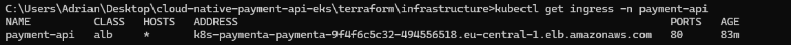
*Ingress resource with ALB address assigned — LBC successfully created the load balancer in public subnets.*
 
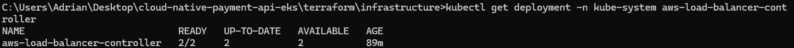
*AWS Load Balancer Controller running with 2/2 replicas ready in kube-system namespace.*
 
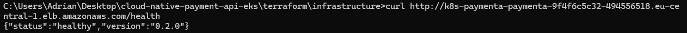
*Application responding to HTTP requests from the public internet via ALB.*
 
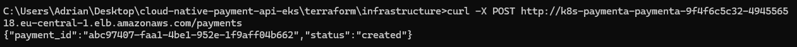
*Full end-to-end flow: internet → ALB → pod → DynamoDB. Payment created and returned via public endpoint.*
 
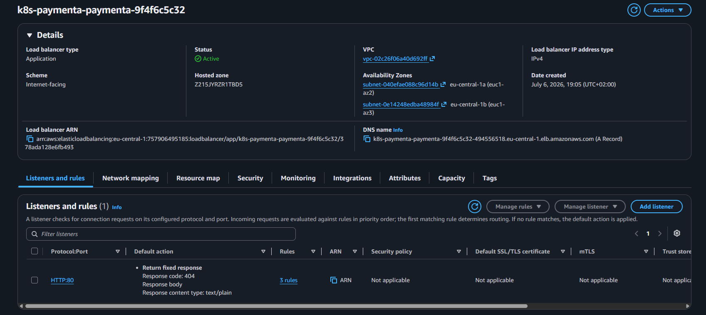
*ALB visible in AWS Console in Active state, placed in public subnets as configured.*
 
```
# Health check via public ALB
curl http://k8s-paymenta-paymenta-9f4f6c5c32-494556518.eu-central-1.elb.amazonaws.com/health
{"status":"healthy","version":"0.2.0"}
 
# Create payment via public ALB
curl -X POST http://k8s-paymenta-paymenta-9f4f6c5c32-494556518.eu-central-1.elb.amazonaws.com/payments
{"payment_id":"0b078664-cabe-4adf-9740-4f196e26991a","status":"created"}
 
# Retrieve payment via public ALB
curl http://k8s-paymenta-paymenta-9f4f6c5c32-494556518.eu-central-1.elb.amazonaws.com/payments/0b078664-cabe-4adf-9740-4f196e26991a
{"payment_id":"0b078664-cabe-4adf-9740-4f196e26991a","status":"created"}
 
# LBC running
kubectl get deployment -n kube-system aws-load-balancer-controller
NAME                           READY   UP-TO-DATE   AVAILABLE
aws-load-balancer-controller   2/2     2            2
```
 
---
 
## Key Lessons Learned
 
**`kubectl describe` is the correct first diagnostic tool for silent failures.** When a resource exists but nothing happens — no ADDRESS, no error, no logs — the Events section in `kubectl describe` almost always reveals the root cause. `kubectl get` shows current state. `kubectl describe` shows history and errors. This distinction matters significantly when debugging controllers like LBC that operate asynchronously.
 
**IAM policies must be kept current with the software version.** LBC v3.x requires permissions that older versions did not. Copying a policy document from documentation or a previous project without checking the current version requirements leads to silent failures. The correct approach is to always reference the official policy document for the specific version being installed.
 
**LBC is a bridge between two worlds, not a native component of either.** It is not an AWS resource (not managed by Terraform) and not a user-facing Kubernetes resource (not applied by the CI/CD pipeline). It lives in the operational layer between infrastructure provisioning and application deployment. Understanding this boundary clarifies why it is installed by Helm separately from both `terraform apply` and `kubectl apply`.
 
**The subnet tags from Sprint 1 paid off here.** The `kubernetes.io/role/elb` tags on public subnets were configured at cluster creation time specifically for this sprint. Without them, LBC cannot discover where to place the ALB. Configuring prerequisites before they are needed — a pattern established in Sprint 1 with the OIDC provider and ServiceAccount — continues to reduce friction in later sprints.
 
---
 
## Sprint Outcome
 
The Payment API is now publicly accessible via a production-grade AWS Application Load Balancer:
 
```
Internet
    → ALB (internet-facing, public subnets)
        → Kubernetes Ingress routing
            → payment-api Service
                → payment-api Pods (private subnets)
                    → DynamoDB (via IRSA)
```
 
The application remains secure — pods run in private subnets with no public IP addresses. Only the ALB endpoint is exposed to the internet. The full request path from internet to database is functional and tested.


## Deployment

### Prerequisites

- Terraform >= 1.5.0
- AWS CLI configured with appropriate permissions
- kubectl >= 1.28
- Docker

### Bootstrap (first time only)

```bash
cd terraform/bootstrap
terraform init
terraform apply
```

### Infrastructure

```bash
cd terraform/infrastructure
terraform init
terraform validate
terraform plan
terraform apply
```

### Configure kubectl

```bash
aws eks update-kubeconfig \
  --region eu-central-1 \
  --name payment-api-eks
```

### Initial image push (first time only)

```bash
ECR_URL=$(cd terraform/infrastructure && terraform output -raw ecr_repository_url)

aws ecr get-login-password --region eu-central-1 \
  | docker login --username AWS --password-stdin $ECR_URL

docker build -t payment-api ./app
docker tag payment-api:latest $ECR_URL:latest
docker push $ECR_URL:latest
```

### Deploy to Kubernetes

```bash
kubectl apply -f k8s/namespace.yaml
kubectl apply -f k8s/
kubectl get pods -n payment-api
```

> From Sprint 2 onwards all deployments are handled automatically by the CI/CD pipeline on every push to `main`.

---

## Future Sprints

| Sprint | Focus | Key Additions |
|---|---|---|
| Sprint 3 | DynamoDB + IRSA | Pod-level IAM, persistent storage, zero access keys |
| Sprint 4 | Public Ingress | AWS Load Balancer Controller, ALB, public endpoint |
| Sprint 5 | Production Readiness | HPA, PDB, Helm chart, RBAC hardening |
| Sprint 6 | Observability | Prometheus, Grafana, Alertmanager, PVC |
| Upgrade 1 | External Secrets | AWS Secrets Manager → k8s Secret |
| Upgrade 2 | NetworkPolicy | Namespace isolation, deny-all default |
| Upgrade 3 | ArgoCD | GitOps flow, separate config repo |
| Upgrade 4 | Multi-Environment | Helm overlays, dev/prod separation |
| Upgrade 5 | Loki | Log aggregation, correlated metrics and logs |

---

[⬆ Back to top](#cloud-native-payment-api-on-amazon-eks)